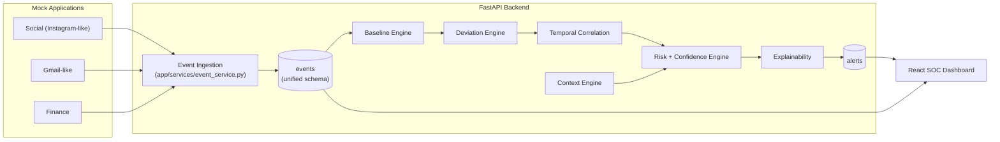

# Silent Shift — Security Behavior Center

**Detecting the insider before the incident.**

A prototype behavioral-security platform built around one idea: don't ask
*"was this event malicious?"* — ask *"how has this account's behavior changed,
and does the change make sense in context?"*

The repo contains a small mock organization (18 fictional employees), three
mock applications that generate realistic activity (Social, Gmail, Finance),
and a fourth application — the **Security Behavior Center** — that watches
all of them through one application-agnostic event pipeline and explains,
in plain language, why an account's behavior looks like it's drifting.

> This is a hackathon prototype. The scoring model is a transparent,
> hand-tuned heuristic — not a validated production security standard.

---

## 1. Architecture



The detection engine (`app/detection`, `app/context`, `app/scoring`) never
imports anything from `app/api/apps.py` or knows the words "Instagram" or
"Gmail" — it only ever reads the unified `Event` model. A future real
integration would only need to call `event_service.record_event(...)`.

### Pipeline

```
Mock Applications → Activity Events → Unified Event Model → Feature
Extraction (Baseline) → Deviation Detection → Context Evaluation →
Temporal / Multi-Signal Correlation → Risk + Confidence →
Explainable Alert → Security Analyst Dashboard
```

---

## 2. Repository structure

```
backend/
  app/
    api/            REST endpoints (users, events, alerts, simulations, apps, settings)
    models/         SQLAlchemy ORM models
    schemas/        Pydantic request bodies
    services/       event ingestion, alert lifecycle, simulation runner, websockets
    detection/      baseline engine, deviation engine, temporal correlation, config
    context/        context engine (legitimate-explanation lookups)
    scoring/        risk engine + deterministic explanation generator
    database/       SQLAlchemy session/engine
  seed/             reference data, activity profiles, scenario generators, seed runner
  tests/            pytest suite
frontend/
  src/
    pages/security/ Overview, Alerts, Users, UserDetail, Timeline, Events, Simulations, Settings
    pages/apps/     Social, Gmail, Finance mock apps
    layouts/        SecurityShell (SOC nav), AppShell (mock-app nav + session context)
    components/     shared UI primitives, BehavioralStateTrack, EventTimeline
    hooks/          CurrentUserContext, SessionContext, useActionRecorder
    services/       typed fetch client
    types/          shared TypeScript types mirroring the API
```

---

## 3. Running it

### Backend

```bash
cd backend
python -m venv .venv
./.venv/Scripts/activate   # or source .venv/bin/activate on macOS/Linux
pip install -r requirements.txt
python -m uvicorn app.main:app --port 8000
```

On first launch the app creates `security_center.db` (SQLite) and seeds it
automatically: 18 users, ~30 days of baseline activity, and three narrative
scenarios (see below). Delete `security_center.db` and restart to reseed.

Run the test suite:

```bash
python -m pytest tests/ -q
```

### Frontend

```bash
cd frontend
npm install
npm run dev
```

Open `http://localhost:5173`. The Vite dev server proxies `/api/*`
(including the simulation WebSocket) to the backend on port 8000.

- **Security Center**: `/security/overview`, `/alerts`, `/users`, `/timeline`, `/events`, `/simulations`, `/settings`
- **Mock apps**: `/apps/social`, `/apps/gmail`, `/apps/finance` — pick "Signed in as" to act as any of the 18 users, and use the **Session** bar to simulate a new device or an unrecognized location for that session.

---

## 4. The unified event model

Every application — mock or, eventually, real — reports activity through a
single call:

```python
record_event(
    db, user_id=..., application="GMAIL", event_type="ATTACHMENT_DOWNLOAD",
    action="ATTACHMENT_DOWNLOAD", resource_id=..., resource_type=...,
    resource_sensitivity="CONFIDENTIAL", device_name=..., location=...,
    data_volume=..., metadata={...},
)
```

The `events` table (`app/models/event.py`) is the only thing the detection
engine reads. Adding a fourth application means writing an adapter that
calls `record_event` — nothing in `app/detection`, `app/context`, or
`app/scoring` changes.

---

## 5. Detection methodology

1. **Baseline** (`app/detection/baseline_engine.py`) — for every user, a
   `LONG_TERM` baseline (a ~21-day window ending 3 days ago) and a `RECENT`
   baseline (the last 3 days) are computed from that user's own history:
   normal hour range, usual locations/devices, application mix, resource
   categories, action frequencies, and daily event/volume statistics.
   Observed hours only ever *widen* a user's declared working-hours
   contract, never narrow it below it.

2. **Deviation** (`app/detection/deviation_engine.py`) — each event is
   compared against the long-term baseline: unusual time, new device,
   unusual location, unusual application, unusual/sensitive resource,
   unusual or sensitive action, and (in aggregate) unusual event/data
   volume over a trailing 24h window. An action or resource is only ever
   flagged as "rare" if it is *both* a small share of activity *and* hasn't
   happened often enough to be an established habit — a once-a-week task
   that's still 100% normal for a role is not a deviation.

3. **Context** (`app/context/context_engine.py`) — active `ContextEvent`
   rows (project assignment, role change, approved travel, new-device
   approval, temporary access, maintenance activity) discount the
   deviation signals they plausibly explain, by a configurable factor per
   context type. Unexplained high-severity signals surface a "no recent
   role or project change explains this" note.

4. **Temporal / multi-signal correlation**
   (`app/detection/temporal_correlation.py`) — signals that span multiple
   applications within a short window, cluster within an hour, or persist
   across multiple days earn additive bonuses on top of the raw deviation
   score. This is what turns six individually low/medium signals into one
   high-confidence, correlated picture.

5. **Risk + confidence** (`app/scoring/risk_engine.py`) — a fully
   transparent, additive formula:

   ```
   risk = baseline_deviation
        + sensitive_resource_bonus
        + cross_app_correlation_bonus
        + burst_correlation_bonus
        + persistence_bonus
   ```

   (context discounts are already baked into each signal's score before
   this sum). **Confidence** is scored separately — from baseline sample
   size and the number/diversity of corroborating signals — answering
   "how sure are we this is a meaningful deviation," not "how bad does it
   look." All weights live in `app/detection/config.py`.

6. **Explanation** (`app/scoring/explain.py`) — bullets are generated
   deterministically from the signal list; nothing here is an LLM call.

7. **Behavioral state** maps the 0–100 risk score to
   `NORMAL → DRIFT → SUSPICIOUS → HIGH_RISK`, visualized as a track on
   every user's investigation page — the product's central visual concept.

8. **Alerts** (`app/services/alert_service.py`) are only created once risk
   clears a threshold (default 30/100), and an alert already open for a
   user is *extended* (evidence merged, `last_observed` bumped) rather than
   duplicated — so a single incident tells one coherent story across days
   instead of generating one alert per anomaly.

---

## 6. Demo scenarios

Seeded automatically on first launch, and re-playable live from the
**Simulation Center**:

| Scenario | What it shows |
|---|---|
| **Normal Organization** | Ordinary daily activity — the baseline for everything else. |
| **Legitimate Project Change** (Priya Nair) | A real behavioral shift (new project, new resources, more email volume) that the context engine explains — risk stays low. |
| **Compromised Account** (Jasmine Carter) | A 6-stage takeover — new device → odd hour → new location → sensitive resource access → large data volume → a fast cross-app burst (Gmail → Social → Finance within one hour). Risk climbs gradually, then spikes. |
| **Malicious Insider** (Wei Zhang) | Same device, same hours, same location — but scope-of-access and action-based drift (viewing accounts outside their portfolio, exporting financial data via email, adding a beneficiary and transferring funds). Demonstrates detection without any device/location signal. |
| **Cross-Application Attack** | Replays the compromised-account's cross-app burst live against a random, previously-normal user, for a fast, dramatic demo. |

The Simulation Center streams each scenario's events over a WebSocket as
they're recorded, then shows the resulting risk score, explanation, and any
alert generated — in real time, against the real detection pipeline (no
canned numbers).

---

## 7. Testing

`backend/tests/` covers baseline computation, deviation detection
(including the "established habit isn't a deviation" false-positive
guard), context discounting, risk scoring (multiple weak signals outscore
one isolated signal; cross-application signals earn a correlation bonus),
and — using the real seed generators — the three behavioral claims that
matter most: a legitimate project change never becomes critical, a
compromised account eventually becomes high risk, and normal users stay
quiet.

```bash
cd backend && python -m pytest tests/ -q
```

---

## 8. What's next

- Swap SQLite for Postgres by changing `DATABASE_URL` (the ORM layer is
  already database-agnostic).
- Peer-group baselining (compare a user against others in the same role,
  not just their own history).
- A natural-language "explain this investigation" pass on top of the
  existing structured evidence (explicitly *not* required for detection to
  work — see product spec).
- Persisting simulation replays as first-class fixtures for regression
  testing the detection engine itself.
# m_hash

